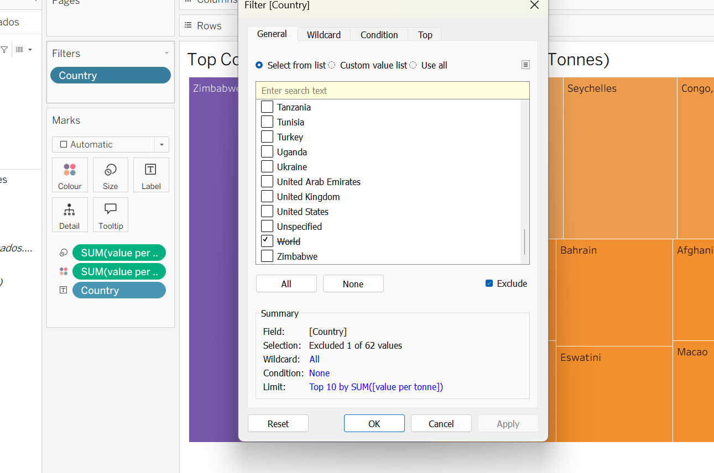
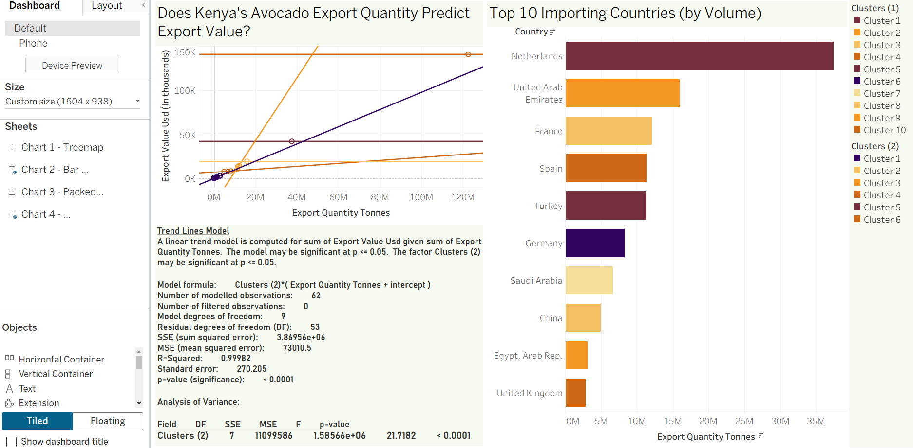
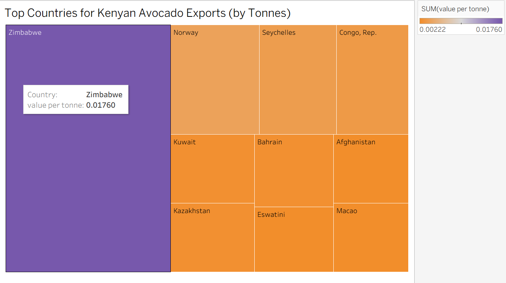
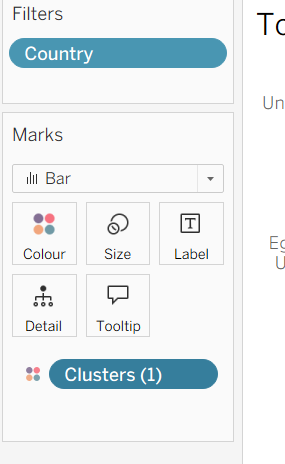

# Avocado Exports From Kenya Analysis
### Data Analyst: [Faiza Abdulqadir](https://github.com/Fazestar01)
**Avocado Exports from Kenya analysis** is a project focused on the ETL (Extract, Transform, Load) pipeline in Jupyter Notebook and visualisations in Tableau. The project examines Kenya's avocado export patterns, trading relationships, and market dynamics to assess competitiveness in the global avocado industry. 

## Navigation
* [Data Investigations](https://github.com/Fazestar01/Avocado-Exports-from-Kenya/blob/main/jupyter_notebooks/kenyan-avocado-investigation.ipynb)
* [Raw Data](https://github.com/Fazestar01/Avocado-Exports-from-Kenya/blob/main/data/raw/kenyan-avocados-guide-2023.csv)
* [Cleaned Data](https://github.com/Fazestar01/Avocado-Exports-from-Kenya/blob/main/data/cleaned/cleaned_kenyan_avocados.csv)
* [Dashboard](https://public.tableau.com/app/profile/faiza.abdulqadir/viz/Kenyan_Avocado_Analysis/KenyanAvocadoExportsAnalysis?publish=yes)

## Dataset Content
* Data was acquried from a dataset on a software that includes several databases from various international organisation [WITS](https://wits.worldbank.org/trade/comtrade/en/country/KEN/year/2023/tradeflow/Exports/partner/ALL/product/080440?utm_source=chatgpt.com#), the data includes avocado export information from 2023 from Kenya showing weight, quantity and trade value.

## Business Requirements
The avocado industry is growing at a rapid rate with increasing international markets. With that being said, Kenya is amoungst one of the new kids on the block when it comes to being an avocado exporter. 

* This is being carried out by an Agricultual Analyst for the exporting company, Globalwema which is based in both the UK and Kenya. The purpose is to give this company insight on the potential produce they wish to embark on.

* The requirement is to look into which countries are Kenyas top trading partners. As countries like Mexico and South Africa have been in the running, is vital to know if Kenya is part of the running.

* In addition, are export volumes and values increasing over time and how is the pricing per tonnne varying across the markets and years. This is worth looking into as although Kenya is now exporting Avocados, does it mean it's a sustanable country in the long run. 

* In terms of future projective predictions, its worth looking at what is happening now and whether if Kenya can compete with the more seasoned players in the avocado exporting world or if this is a short term matter.

## Hypothesis and how to validate?

The following hypotheses reflect the initial expectations and goals of the project. However, as the analysis progressed, the results challenged these assumptions, prompting a shift in direction and a refinement of the original hypotheses.
Below, you will find my original hypothesis and then the new refined hypothesis shortly after that. This evolution highlights the power of data to reshape understanding; what started as a confident prediction turned into a more nuanced insight:

###  *Original Hypothesis 1* Kenya’s avocado export value is increasing year over year:
* Despite the fact that the Kenyan market for avocados is growing, the original hypothesis seemed quite vague due to the fact that the dataset findings were based on a year basis, just 2023 to be exact. Given that the avocado market is indeed growing, we still can't assume consistent year - on - year growth from a narrow dataset. This makes the analysis almost temperamental as change would be more ideal IF it had shown a monthly growth. The information given from the dataset might be oversimplified due to external factors like inflation, currency or market shocks. It is hard to tell. Not having monthly breakdowns as well as only having annual totals keeps a vague idea on what is to come for the avocado market in Kenya.

Another point to add is the category ‘World’. Upon cleaning and using the data for visualisation, I noticed that the dataset had a category under ‘World’ that sat under the ‘Country’ column. This was another vague data point as it was too broad for analysis and very tedious to figure out what countries were under ‘world’. 

At this point I had already added this into the Jupyter Notebook visualisation (see below) to show the client how vague this point was and that moving forward, the more advanced analysis on the Tableau visualisations wouldn’t need or miss out the finalisation of this analysis.

### *Original Hypothesis 2* Countries that import the most avocados from Kenya are also the ones paying the highest value:
* This is another point of assumption as it assumes a direct relationship between volume and value. This doesn't work on a wide spectrum as it oversimplifies the fact that some countries buy more but pay less per unit. Just having that as a statement ignores unit pricing and doesn't distinguish between value per tonne vs total value. 

It would be easy to say that this could have been the hypothesis for this section but it wouldn't be just as some countries pay more than others and still don't get the value of money compared to other countries. As you will see on the revised hypothesis further down, you will get an idea that just because a country is paying more, it doesn't equate to a higher quantity.

The final point is this original hypothesis does not account for trade deals, distance or value-added processing that comes with the produce trading world nor does it factor localisation pricing. 

### *Original Hypothesis 3* Kenya’s avocado export quantity is increasing annually:
* This hypothesis is an interesting one because, yes, indeed it may be true, but again relies on time-series granularity which this dataset did not have. The pain point of this dataset is the fact that this one in particular was broken down annually, which is the main reason as to why we didn't get to explore certain angles. Temporal growth does not explain economic value or market behaviour.

## Hypothesis testing:
All visualisations that test our hypotheses can be found in this [Dashboard](https://public.tableau.com/app/profile/faiza.abdulqadir/viz/Kenyan_Avocado_Analysis/KenyanAvocadoExportsAnalysis?publish=yes) 

### *New Hypothesis 1* Some countries pay a significantly higher price per tonne for Kenyan avocados than others
#### Chart 1 - Treemap:

*Strongly supported — treemap shows major price variation by country (e.g. Zimbabwe vs Netherlands), suggesting different pricing strategies or trade relationships.*

* The focus is narrowed down more and focuses on `value per tonne` (unit price) and now offers a country - level comparison. This factors in that countries have their own tariffs and value- added prices which makes it common knowledge when it comes to different country currencies. 

* This new hypothesis also accounts for disparities in trade relationships (e.g. Zimbabwe vs Netherlands) which upon seeing the data, is unfortunate for Zimbabwe as they are paying more especially as we should factor in that they no longer trade in their local currency but in the US dollar due to the plummet on the Rhodesian Dollar before the new Dollar was introduced.

#### Verdict:
We get to uncover premium-paying countries, which may point out more niche markets and better trade terms which is a plus for analysis. This way it shows Zimbabwe pays more per tonne, while Netherlands imports more but pays less per tonne.

### *New Hypothesis 2* The top avocado importers by quantity are not necessarily those paying the most per tonne:
#### Chart 2 - Bar Chart:

*Supported — bar chart (quantity) vs treemap (value per tonne) shows clear divergence; high-volume buyers don't always pay the most per tonne.*

This hypothesis is more supported, as it gives a deep dive on the disparity between **bulk buyers** and **premium buyers**. This opens up a discussion on **value** VS **volume** as it shows more nuance and reflects more on real- world trade complexities. An interesting point to add is that The Netherlands have been big importers as they work with several international supermarket chains that operate worldwide making them the hub of importing avocados.

#### Verdict:
The Netherlands is a top importer by quantity but pays less per tonne. Whilst in contrast with Zimbabwe, they import less but at a higher value per unit.
 

### *Hypothesis 3* There is a positive relationship between Kenya’s avocado export quantity and export value, but outliers exist:
#### Chart 4 - Regressive Line (Quantity vs Value):

*Partially supported — regression line shows a clear positive trend, but the 'World' outlier skews the relationship slightly. Strong R² and p-value give this statistical credibility.*

**P-value – Significance of the relationship (typically should be < 0.05)**

**R² (R-squared) – Strength of the correlation (closer to 1 is strong)**

This regressive chart tests the correlation between quantity and value, so this introduces regression analysis and clusters. The part that is a little skewed but also an important aspect as it shows `outliers` like ‘World’ totals. 

#### Verdict:
This shows that generally, more export quantity results in higher value which we have shown on previous hypothesis but ‘World’ is a major outlier, likely an aggregated or unmatched entry distorting the trend.

### *BONUS HYPOTHESIS* Some countries contribute large export value through small quantities, suggesting niche or high-value markets:

#### Emerging Insight (from combining Chart 1 & 3):

This bonus insight is derived from comparing Chart 1 (value per tonne) with Chart 3 (total export value). This bonus shows the mismatch in volume vs impact and opens the discussion on premium pricing, trade efficiency and strategic partnerships.
 

## Project Plan
The project board that aided in our planning and organisation can be found [here](https://github.com/users/Fazestar01/projects/7/views/1)

### High-Level Steps Taken

**Angle Used**  
The point was to explore the agriculture world and what is happening in the world of produce. Knowing of a client, Globalwema, that is currently exporting avocados from Kenya and having an insight of the current situation and somewhat struggles they are facing in the agriculture world is a key point on this project. Currently Kenya is projected to grow year by year in avocaods as it is now becoming the top exporters for avocados in Africa, almost surpassing South- Africa, which have been the top exporters for avocados from Afrca in the last 15 years. So it only seemed right to get in front of that and support Globalwema to the growing market of avocados.

I then used a dataset website under the world bank where I found insights on the 2023 avocado reports and data.

The angle used is to analyse who the key drivers are when it comes to importing avocados from Kenya and how much is exported, also giving a feel on the volume and value.

**Dataset Selection**  
I selected the [Kenyan Avocado 2023 dataset on WITS](https://wits.worldbank.org/trade/comtrade/en/country/KEN/year/2023/tradeflow/Exports/partner/ALL/product/080440) for its reliability on the data giving the company that curated the data — including country, year, quantity making it ideal for both statistical testing and visual storytelling.

**Planning & Analysis Flow**
1. Problem Definition & Hypothesis Planning
* The initial goal was to understand how Kenya’s avocado exports differ by country in terms of value, quantity and pricing.

* Initially 3 hypotheses were developed which were later refined based on data limitations (e.g, lack of monthly/yearly data granularity)
* Focus is shifted to country-level comparisons and statistical relationships instead.

2. Data Acquisition & Cleaning
* The data was soured from (WITS) 
* Cleaned using Python (Pandas), including handling missing values, filtering out vague entries like 'World', and calculating unit price per tonne.

3. Exploratory Data Analysis (EDA)
* Conducted using Jupyter Notebook with Pandas, Seaborn and Plotly.
* Visuals like bar charts, treemaps, boxplots and regression lines were used to test hypotheses and identify patterns.

4. Hypothesis Testing 
* Each hypothesis was tested through relevant visualisations or statistical analysis
* Hypothesis 3 (correlation between quantity and value) was backed with regression analysis (p-value, R²). 

**Data Cleaning**
- Missing null values.
- Fix errors in the data.
- Filtering out vague entries like ‘World’ and calculating unit price per tonne.

### Data Management Throughout the Project

| **Step**        | **Action**                                                                                                                                             |
|-----------------|---------------------------------------------------------------------------------------------------------------------------------------------------------|
| **Collection**  | Downloaded the file which was originally a .xslx file from the WITS database website and once downloaded, it was converted into a CSV ready for cleaning.                                       |
| **Processing**  | Used Python (Pandas) in Jupyter Notebook to clean and transform avocado export data, including column standardisation, filtering out vague 'World' entries, calculating price per tonne metrics, and preparing the dataset for Tableau visualisation.                        |
| **Analysis**    | Conducted data exploration and analysis using both Jupyter Notebook and Tableau to uncover patterns and trends. Used statistical techniques like correlation analysis to test relationships between export quantity and trade value.
| **Interpretation** | Created interactive Tableau dashboards with charts and explanations to present the data findings in an easy-to-understand visual format. |

---

### Rationale for Research Methodologies

- **Used descriptive statistics & exploratory data analysis (EDA):** This was done to understand distribution, central tendencies and outliers in avocado export data.
- **Applied Visual Analytics:** From Bar charts, Box plots, treemaps on Juypter Notebook and Tableau Public to spot country level patterns in export quantity and value. Tableau was also used to better communicate insights to non-technical audiences through engaging visual storytelling.
- **Tested hypothesis 3 using linear regression:** This was to evaluate the statistical strength of the relationship between quantity and export valiue (back with p-value and R²).
- **Adapted hypotheses based on data structure and granularity:** Which focused on available dimensions like country and total export volume/value rather than time.
- **Removed or addressed vague categories (e.g., ‘World’):** This was to maintain clarity and focus on country- level analysis.
- **Blended statistical analysis with data storytelling:** Which allowed for both quantitative evidence and intutive, human-readable narratives.

## The rationale to map the business requirements to the Data Visualisations
#### Identify key markets and revenue drivers: 
Understanding Kenya's avocado export performances and to identify key markets in order to inform strategic trade decisions and uncover economic opportunites.

### Viusalisation 1: Treemap of Kenya's Avocado Export Quantity by Country:
Rationale:
The treemap offers a clear, proportional view of which countries import the highest quantities from Kenya. This helps quickly identify key trade partners by volume and supports prioritisation of logistics or trade negotiations. It's also good to know for the client to have a feel on how pricing works in different countries.

### Visualisation 2: Bar Chart of Top 10 Exporting Countries by Volume:
Rationale:
This visual gives a snapshot ranking of Kenya's leading export destinations. Its useful for comparative analysis across countries and also supports discussions around market focus or diversification.

### Visualisation 3: Packed Bubble Chart of Export Value by Country:
Rationale:
This visual maps out the economic value per country, helping identify markets where price per tonne may be higher.  Comparing this with the volumes on (Chart 1 or 2) helps identify high-value but low-volume markets, or vice versa. 

### Visualisation 4: Linear Regression (Export Quantity vs Export Value):
Rationale:
For this chart, it helps explore whether increased export volume leads to greater export value. Including p-value and R² which provides statistical strength to the relationship, guiding evidence-based decisions in export planning.

## Analysis techniques used
* The ETL pipeline was done in a Jupyter notebook using pandas which can be found  [here](https://github.com/Fazestar01/Avocado-Exports-from-Kenya/blob/main/jupyter_notebooks/kenyan-avocado-investigation.ipynb). This allowed a structure throughout the analysis and kept all coding and understanding in a seamless order. After having this first part done, it was easier to continue the more advanced analysis through Tableau Public.
* The data was a tad limiting but did not stop me from being able to make a comprehensive analysis for a good enough overview on the Kenyan avocado landscape. The only push back was the 'World' outlier and having the dtaset set to an annual overview but this was soon resolved as it allowed for a better angled hypothesis from the ones before.
* I used generative AI to resolve questions regarding dashboarding and git as well as any bug issues. 

## Ethical considerations
* The dataset contains no sensitive information  as its public information thus does not require anonymisation or other ethical steps.

## Dashboard Design
*The Dashboard can be found [here](https://public.tableau.com/app/profile/faiza.abdulqadir/viz/Kenyan_Avocado_Analysis/KenyanAvocadoExportsAnalysis?publish=yes)*.
### Dashboard preparation:
The data was at this point focused on volume and value. It was important to portray that throughout the dashboard and storytelling. 

**As mentioned before, the outlier for 'World' had to removed to give a more accurate overview.(see below)**

I then proceeded to create a dashboard which was then later added to the Tableau Story. The reasoning behind this is I find creating a dasboard allows for better visual creation as apposed to the Tableau worksheet, which I tend to soley use to import and create grapth.

Below is an example of how I would put together a dashboard, even if it doesn't make the cut, it gives me a great working ground to determine what works best.

I then used a Tableau Story format to keep the dashboard clean and easy to go through. Viewers can explore each hypothesis using the buttons at the top also with the title of the analysis.

### Dashboard for hypothesis 1:

The first chart was interesting to create as the initial plan was to create a bar or line chart. As I had mentioned before the issue was the fact that it lacked a more detailed time scale as this one only showed annual data. This is where the turning point was which then made room for the hypothesis to be based on `value per tonne` vs `country`.

On the Treemap you will see the top 10 countries, for a more narrow analysis, on which country get exports from Kenya by tonne. 

Naturally as I was focusing on the top 10 countries, the filter was applied to make sure the focus was on the top 10 countries. 

I then Marked the section of `price per tonne` and `country` into colours and shapes to give a visual overview on which country did the mosgt to the least.

The final touch was the theme colours I used which will be different shades of Orange and a touch of Purple and Navy, thoughout this visualisation on Tableau.

Once, alll this was put together on the Worksheet and Dashboard, I was then able to add this final chart onto the Story Tableau board, this is now were I added text for a personable feel on what I got from this with the hypothesis as well as importantly, what chart or analysis I comparing chart 1 to. 
As it shows, hypothesis 1 was strongly supported as I am showing `value` VS `volume` is a good analysis to start with.

### Dashboard for hypothesis 2:

The bar chart was the easiest to figure out as it was the one that was closest to the original plan for the chart creation. The chart started off with all countries shown (expect 'world') but then became clear that showing the top 10 countries that import avocaods would be a better shot to explore. 

As I mentioned before, I tend to use the Worksheet Tableau area to create charts. Here I create the filters and insert what needs to be on the rows and columns.
For this chart it was a lot simple with just the `export quantity` and the `country` used on the chart.

The filter stays the same with the countries showing 'Top 10' but for this a cluster on the colour was added, to give a more diverse colour palette (e.g Netherland is Blue, Saudi Arabia is Green etc) to avoid the bar looking flat.

### Dashboard for hypothesis 3:

We are analysing whether drivewheel type affects car pricing.

A box plot is used to compare the price distribution across 4WD, FWD, and RWD vehicles.
To enhance interactivity, we included the same Carbody and Fueltype filters as in Hypothesis 2, allowing viewers to explore pricing patterns in more detail.

### Our logo:

To highlight that our team created this work, Datalicious, we added our logo to the top of each page

## Development Roadmap and issues faced
* The types of measurements for things such as height, weight etc were not included, to resolve this we asked Copilot what it thought the most reasonable assumption of the measurements are.
* One aspect of data cleaning was overlooked, 'VW' should have been changed to 'Volkswagen' in the Jupyter notebook. This was solved by using the 'groupby' function in Tableau to group VW under Volkswagen. 
* We had struggles with git that were resolved with a mixture of co-pilot and help from our tutors.
* Images couldn't be moved into an image folder without them being removed from github. That will be something we look more into for the next project.

## Main Data Analysis Libraries
* Pandas
* Numpy

## Credits 

* Code Institute Learning Management System modules on pandas and tableau
* Microsoft co-pilot to help in code generation and understanding 
* Chat-GPT for questions regarding dashboarding in Tableau and technical issues
* [Markdown Guide](https://www.markdownguide.org/)

### Media

- Header image was made using Canva

## Acknowledgements
* A huge thank you to Emma, Mark, John, Spencer and Niel from Code Institute for their hard work in tutoring us and your patience. It's been a journey from learning to print `HELLO WORLD` to full on coding!

[Back to top](#top)